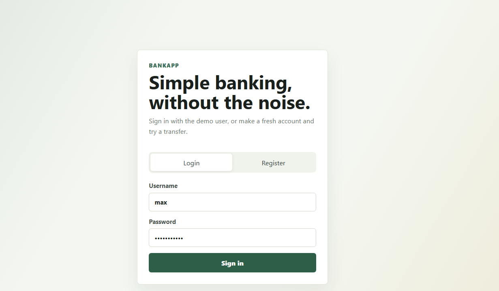
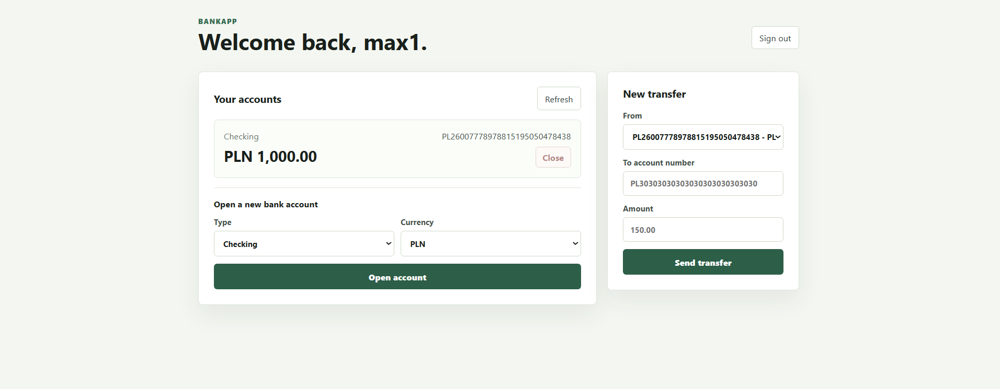

# JavaBankApp

Small banking app made with Spring Boot and React. It is not meant to be a real bank system, obviously, but it has the main pieces I wanted to practice: users, accounts, transfers, JWT login, database models, and some tests around the transfer flow.

The project is split into two parts:

- backend: Java 17, Spring Boot, Spring Security, Spring Data JPA
- frontend: React with Vite

## What works

- register and login
- passwords are stored with BCrypt, not plain text
- JWT token is used for protected API calls
- logged-in user can see their own accounts
- logged-in user can open another bank account from the dashboard
- empty accounts can be closed from the dashboard
- user can send a transfer from their own account
- backend checks balance, amount, account numbers, owner, and currency
- transfer is wrapped in a database transaction
- there are unit and integration tests for the transfer logic

## Running it locally

Backend demo mode uses an in-memory H2 database and creates two demo users.

```powershell
.\mvnw.cmd spring-boot:run "-Dspring-boot.run.profiles=dev"
```

Demo login:

```text
max / password123
ana / password123
```

Then run the frontend:

```powershell
cd frontend
npm install
npm run dev
```

Open:

```text
http://127.0.0.1:5173
```

## Screenshots

This is how it looks when it is running locally.





## PostgreSQL setup

The default backend config is prepared for PostgreSQL. Set env vars like this:

```powershell
$env:DATABASE_URL="jdbc:postgresql://localhost:5432/bankapp"
$env:DATABASE_USERNAME="bankapp"
$env:DATABASE_PASSWORD="bankapp"
$env:JWT_SECRET="replace-this-with-a-long-random-secret"
.\mvnw.cmd spring-boot:run
```

For learning and quick clicking around, the `dev` profile is easier.

## Tests

```powershell
.\mvnw.cmd test
```

There is a unit test for insufficient balance and an integration test that goes through registration, account loading, and a real API transfer using H2.

## Project notes

The most important class is probably `TransferService`. That is where the business rules live. Controllers are intentionally thin, repositories only talk to the database, and DTOs are used so the API does not expose full JPA entities.

Things I would add next:

- transaction history screen
- Flyway migrations
- Docker Compose for PostgreSQL
- better token storage than localStorage
- proper account number validation
